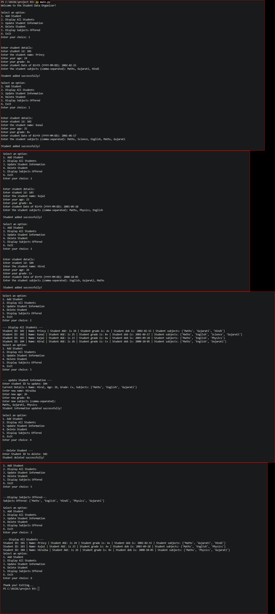

# Collection Manipulator - Student Data Organizer

## 📌 Project Description

The **Student Data Organizer** is a Python-based project that is used to store and manage student information.

This project demonstrates the use of different Python collection types such as **List, Dictionary, Set, and Tuple**.

The program allows the user to:

* Add student information
* Display all students
* Update student information
* Delete a student
* Display subjects offered
* Exit the program

---

## ✨ Features

* Add Student
* Display All Students
* Update Student Information
* Delete Student
* Display Subjects Offered
* Exit the program
* Handles invalid menu input using `try-except`
* Stores multiple students using a List
* Stores student details using a Dictionary
* Stores unique subjects using a Set
* Stores Student ID and Date of Birth using a Tuple

---

## 🛠️ Technologies Used

* Python
* VS Code
* Git
* GitHub

---

## 📚 Collections Used

### 1. List

The list is used to store multiple student records.

```python
student_list = []
```

### 2. Dictionary

A dictionary is used to store the details of each student.

```python
student_dict = {
    "name": name,
    "age": age,
    "grade": grade,
    "subjects": subject_set,
    "info": std_info
}
```

### 3. Set

A set is used to store subjects and avoid duplicate subjects.

```python
subject_set = set()
```

### 4. Tuple

A tuple is used to store the Student ID and Date of Birth.

```python
std_info = (student_id, dob)
```

---

## 📋 Menu Options

```text
1. Add Student
2. Display All Students
3. Update Student Information
4. Delete Student
5. Display Subjects Offered
6. Exit
```

---

## ➕ 1. Add Student

This option allows the user to enter student details:

* Student ID
* Name
* Age
* Grade
* Date of Birth
* Subjects

Example:

```text
Enter student id: 101
Enter the student name: Rahul
Enter your age: 17
Enter your grade: 11
Enter student Date of Birth (YYYY-MM-DD): 2009-05-15
Enter the student subjects (comma-separated): Maths, Physics, Chemistry

Student added successfully!
```

---

## 📋 2. Display All Students

This option displays all student information stored in the program.

Example:

```text
--- Display All Students ---

Student ID: 101 | Name: Rahul | Student AGE: is 17 | Student grade is: 11 | Student dob is: 2009-05-15 | Student subjects: {'Maths', 'Physics', 'Chemistry'}
```

---

## ✏️ 3. Update Student Information

This option allows the user to update an existing student's:

* Name
* Age
* Grade
* Subjects

The student is searched using the **Student ID**.

Example:

```text
--- update Student Information ---

Enter student ID to update: 101

Current Details-> Name: Rahul, Age: 17, Grade: 11, Subjects: {'Maths', 'Physics'}

Enter new name: Rahul Patel
Enter new age: 18
Enter new grade: 12
Enter new subjects (comma-separated):
Maths, Physics, Computer

Student information updated successfully!
```

If the Student ID is not found:

```text
Student ID not found!
```

---

## 🗑️ 4. Delete Student

This option allows the user to delete a student using the Student ID.

Example:

```text
---Delete Student ---

Enter Student ID to delete: 101
Student deleted successfully!
```

If the Student ID does not exist:

```text
student ID not found!
```

---

## 📚 5. Display Subjects Offered

This option displays all unique subjects available in the student records.

Example:

```text
---Display Subjects Offered---

Subjects Offered: {'Maths', 'Physics', 'Chemistry', 'Computer'}
```

A **Set** is used so that duplicate subjects are removed.

If there are no subjects:

```text
No subjects found!
```

---

## 🚪 6. Exit

This option exits the program.

```text
Thank you! Exiting...
```

---

## ⚠️ Error Handling

The program uses `try-except` to handle invalid menu input.

```python
try:
    choice = int(input("Enter your choice: "))
except ValueError:
    print("Please enter a number from 1 to 6.")
```

If the user enters something other than a number, the program displays an error message.

---

## 📁 Project Structure

```text
├── main.py
├── output.png
└── README.md
```

---

## ▶️ How to Run

### Step 1

Install **Python 3** on your computer.

### Step 2

Open the project folder in **VS Code**.

### Step 3

Open the terminal.

### Step 4

Run the following command:

```bash
python main.py

---

## 🎯 Learning Objectives

Through this project, I learned:

* Lists in Python
* Dictionaries in Python
* Sets in Python
* Tuples in Python
* `while` loops
* `for` loops
* `if-elif-else`
* User input
* Error handling using `try-except`
* Adding data
* Updating data
* Deleting data
* Displaying data
* Working with collections

---

## 📸 Output




## 👨‍💻 Author

**KAJAL**


